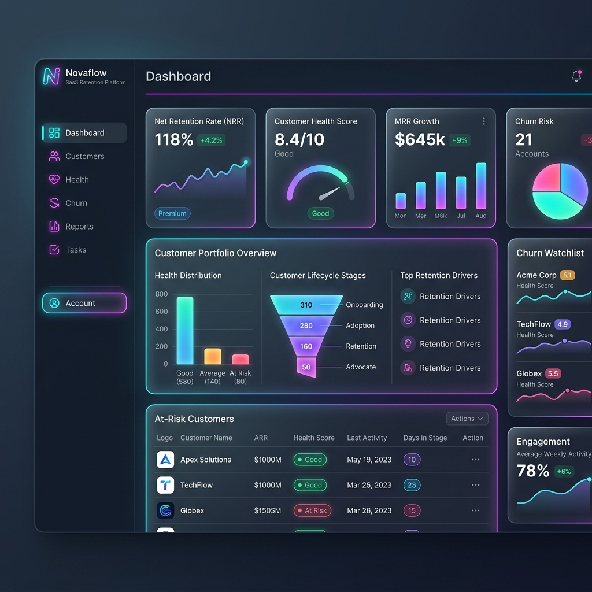

#  NovaFlow

> **NovaFlow** is a predictive intelligence engine and interactive customer growth platform built for proactive Customer Success, Account Management, and RevOps teams to confidently secure renewals, analyze telemetry, and automate Net Retention Rate (NRR) expansion.

---

## 🖥️ Dashboard Preview


---

## ✨ Key Features

- **📊 Real-time Telemetry & Health Scoring**: Automatically analyze customer usage patterns, seat activation rates, and support ticket frequencies to output dynamic account health ratings.
- **⚡ Automated Growth Playbooks**: Trigger predefined engagement playbooks immediately when specific usage drops or expansion signals are detected.
- **🎨 Ultra-Premium Design System**: Built with modern dark-mode glassmorphic layouts, harmonious color palettes, fluid neon glow accents, and elegant micro-animations.
- **🙋 Interactive Customer Hub**: Custom interactive elements such as an FAQ accordion, responsive charts, and user success resource modules.
- **📱 Responsive Mobile-First Layout**: Fully optimized and pixel-perfect across desktop, tablet, and mobile screens.

---

## 🛠️ Technology Stack

- **Core**: HTML5, Vanilla JavaScript (Modern ES6+)
- **Styling**: Vanilla CSS (Tailored HSL variables, fluid gradients, custom animations)
- **Framework & Bundler**: Vite (Fast HMR development server and optimized production builds)
- **Fonts & Typography**: Outfit & Inter via Google Fonts

---

## 🚀 Getting Started

### Prerequisites

Make sure you have [Node.js](https://nodejs.org/) installed (v18+ recommended).

### Installation

1. **Clone the repository**:
   ```bash
   git clone https://github.com/ArnavNah/Novaflow.git
   cd Novaflow
   ```

2. **Install dependencies**:
   ```bash
   npm install
   ```

3. **Start the development server**:
   ```bash
   npm run dev
   ```

4. **Build for production**:
   ```bash
   npm run build
   ```

---

## 📁 Project Structure

```
├── dist/                  # Production builds (built assets)
├── src/
│   ├── main.js            # Core application logic and interaction setup
│   └── style.css          # Design system, CSS variables, and layout styles
├── index.html             # Application entry page (fully customized copy)
├── vite.config.js         # Vite bundler configuration
└── novaflow_dashboard.png # Mockup asset for README documentation
```

---

## 📄 License

This project is licensed under the MIT License.